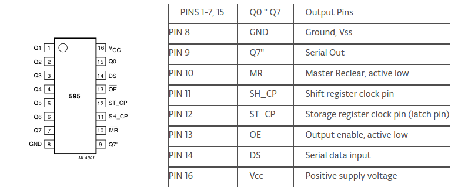

# sprayer_controller
## Overview
This package contains the controllers for the pump and the motors
This package uses the 74hc595 shift register to create 8 PWM signals for the motors

## Installation

### Dependencies
* [WiringPi for Odroid](https://github.com/hardkernel/wiringPi)

To install WiringPi clone the github repo

```
git clone https://github.com/hardkernel/wiringPi
cd ~/wiringPi
git pull origin
./build
```

### GPIO layout



pin       | Odroid c2 | 74hc595
-------|----------|---------
Clock pin | GPIO 11 | Pin 11
Latch pin | GPIO 13 | Pin 12
Data pin | GPIO 15 | Pin 14


